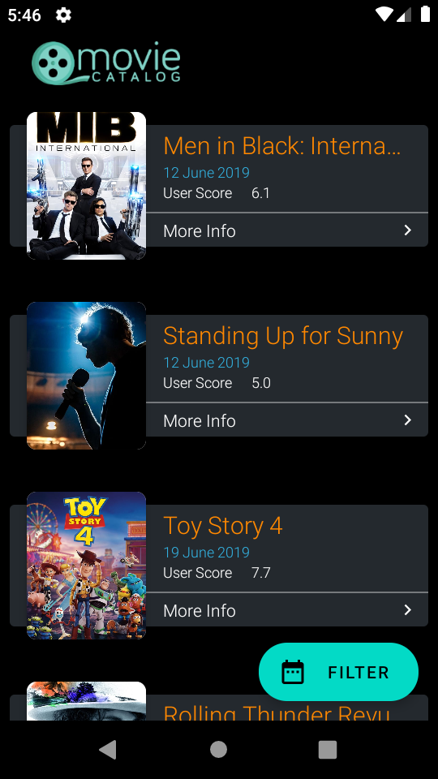
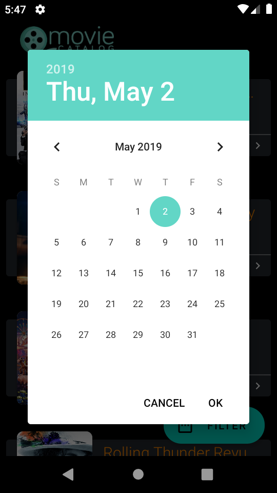
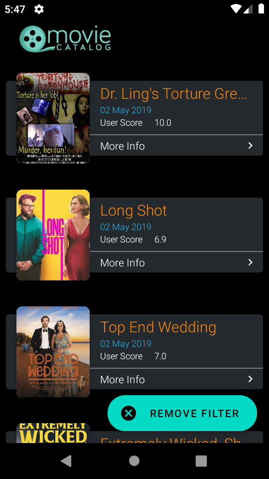
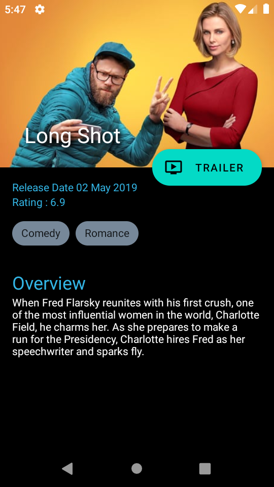

# TheMovieCatalog

Android App Querying TMDb API to provide information on popular, trending, upcoming movies  from [The Movie DB](https://www.themoviedb.org) having selective date filter as well.

## Prerequisites
 
 1. **Obtain Key**
 
    Create an account with TMDB to obtain an API key. Read [Get Started](https://developers.themoviedb.org/3/getting-started) for more details.
 
 2. **Configure build.gradle**
 
    Once you have your TMDB key,you will need to add it in the `app` module `build.gradle`. Change the following line with your own API key and sync the project. 

            buildConfigField "String", "API_KEY", '"xxxxxxxxxxxxxxxxxxxxxxxxxxxxxxxx"'

## Features
- Latest movies information.
- Endless Scrolling (Pagination based on themoviedb.org api data)
- Movie details (e.g. Backdrop Poster, Rating, Genres, Release Date, Overview)
- Trailer Video for Youtube

## User Guidelines
- Upon launching, app automatically fetches first page containing 20 movies.
- Scrolling to bottom causes app to fetch next page and new movies are appended in the list automatically.
- Tapping on Filter button will show a Date Picker, which can be used to filter movies on basis of release date.
- After selecting the date and taping on Ok button, will cause app to fetch the movies from the API for that date, along with pagination feature.
- Upon selecting any movie from the list will open movie detail page.
- Movie detail page will show, movie backdrop poster, name, rating, genres and overview.
- Tapping on the Trailer button will go to the pre-installed Youtube app for the trailer.
- Detail screen is collapsing, scrolling it up will hide the backdrop image.

### Screenshots

|   |   |  |  |  |
|:---:|:---:|:---:|:---:|:---:|
| |  |  |  |  |

## Technical Notes

### Architecture
- [MVVM](https://developer.android.com/topic/libraries/architecture) for project architecture.
- [Kotlin Coroutines](https://kotlinlang.org/docs/reference/coroutines-overview.html) concurrency design pattern to safely call network operations.
- [Dagger 2](https://github.com/google/dagger) for implementing dependency injection

### Other Libraries Used

 - [Retrofit](https://square.github.io/retrofit/) - Http Client for Api Calls
 - [Moshi](https://github.com/square/moshi) - Serialization/Deserialization Library
 - [Okhttp](https://github.com/square/okhttp) - An HTTP+HTTP/2 client for Android 
 - [Picasso](https://square.github.io/picasso/) - Image Loading Library
 - [Mockito](https://github.com/mockito/mockitot) - Mocking Framework for Unit Testing
 - [Architecture Components](https://developer.android.com/topic/libraries/architecture) - LiveData, Databinding, ViewModels
 
### Unit Tests

 - Unit test for the ViewModels
 - Instrumental test for Splash screen

## Authors

* **Ali Ansari** - (https://www.linkedin.com/in/ali-ansari-pingo/)

## License
This project is licensed under the MIT License - see the [LICENSE.md](LICENSE.md) file for details
